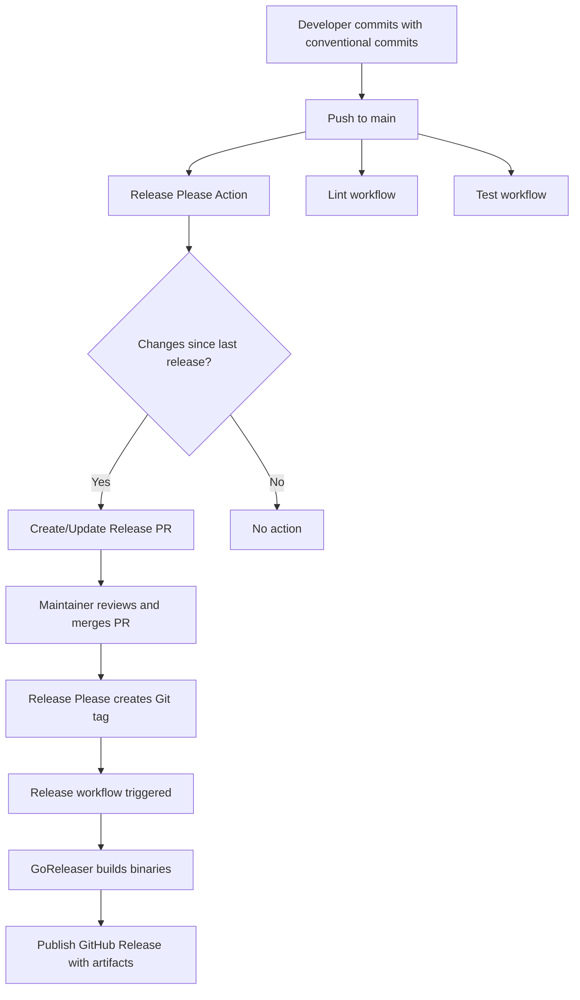

# CI/CD Setup

This document describes the continuous integration and deployment setup for
gomdlint.

## Overview

The project uses a modern, automated release workflow based on:

- **Release Please**: Automated changelog generation and version bumping
- **GoReleaser**: Cross-platform binary building and GitHub release publishing
- **GitHub Actions**: Orchestration of the entire workflow

## Workflow Architecture



## Workflows

### 1. Lint Workflow (.github/workflows/lint.yml)

Runs on every push and PR to main when Go files change.

- Executes `golangci-lint` with strict settings
- Uses golangci-lint action v7 for optimal performance
- Caches Go modules for faster runs

### 2. Test Workflow (.github/workflows/test.yml)

Runs on every push and PR to main when Go files change.

- Executes all tests with race detection
- Generates coverage reports
- Uploads coverage to Codecov (optional)

### 3. Release Please Workflow (.github/workflows/release-please.yml)

Runs on every push to main.

**What it does:**

- Analyzes commit messages since last release
- Determines next version using semantic versioning
- Creates or updates a release PR with:
  - Version bump in relevant files
  - Updated CHANGELOG.md with categorized changes
  - Release notes

**Configuration:**

- `.release-please-config.json`: Release Please settings
- `.release-please-manifest.json`: Current version tracking

### 4. Release Workflow (.github/workflows/release.yml)

Triggers when a version tag (v*.*.*) is pushed.

**What it does:**

- Builds binaries for multiple platforms:
  - Linux (amd64, arm64)
  - macOS (amd64, arm64)
  - Windows (amd64, arm64)
- Generates checksums
- Creates GitHub release with artifacts
- Injects version info via ldflags

**Configuration:**

- `.goreleaser.yml`: GoReleaser build settings

## Conventional Commits

Release Please requires conventional commit messages to work correctly.

### Format

```text
<type>(<scope>): <description>

[optional body]

[optional footer]
```

### Types

- `feat`: New feature (triggers minor version bump)
- `fix`: Bug fix (triggers patch version bump)
- `perf`: Performance improvement
- `refactor`: Code refactoring
- `test`: Adding or updating tests
- `build`: Build system changes
- `ci`: CI configuration changes
- `docs`: Documentation only changes
- `chore`: Maintenance tasks

### Breaking Changes

Add `BREAKING CHANGE:` in the footer or `!` after type to trigger major version
bump:

```yaml
feat!: redesign API interface

BREAKING CHANGE: The API interface has been completely redesigned
```

### Examples

```bash
feat: add markdown table linting
fix: correct heading level calculation
perf: optimize file reading with bufio
refactor: simplify parser logic
test: add comprehensive link validation tests
ci: update golangci-lint to v2
```

## Release Process

### Automated Flow

1. **Develop**: Create commits using conventional commit messages
2. **Push**: Push to main branch
3. **Review**: Release Please creates/updates a release PR
4. **Merge**: Merge the release PR when ready
5. **Release**: Tag is created automatically, triggering binary builds

### Manual Release (if needed)

```bash
# Tag a release manually
git tag -a v0.1.0 -m "Release v0.1.0"
git push origin v0.1.0
```

## Version Variables

The application embeds version information at build time:

```go
// Set via ldflags during GoReleaser build
var (
    version = "dev"     // Semantic version
    commit  = "none"    // Git commit SHA
    date    = "unknown" // Build timestamp
)
```

Development builds show:

```yaml
Version: dev
Commit: none
Built: unknown
```

Release builds show actual values:

```yaml
Version: v0.1.0
Commit: abc123def456
Built: 2025-11-30T12:34:56Z
```

## Configuration Files

### .release-please-config.json

Configures Release Please behavior:

- `release-type`: Set to "go"
- `package-name`: Project name
- `bump-minor-pre-major`: Bump minor version before 1.0.0
- `changelog-sections`: How to categorize commits

### .release-please-manifest.json

Tracks current version:

```json
{
  ".": "0.0.0"
}
```

Updated automatically by Release Please.

### .goreleaser.yml

Configures binary builds:

- Build matrix (OS/arch combinations)
- Binary name and location
- Archive formats
- Ldflags for version injection
- Files to include in release

## GitHub Permissions

Workflows require these permissions:

- `contents: write` - Create releases and tags
- `pull-requests: write` - Create release PRs
- `packages: write` - Publish packages (if needed)

These are configured in the workflow files and work with `GITHUB_TOKEN`.

## Testing Locally

### Test GoReleaser build

```bash
# Install GoReleaser
brew install goreleaser

# Test build without publishing
goreleaser release --snapshot --clean --skip=publish

# Check dist/ directory for built binaries
ls -lah dist/
```

### Test linting

```bash
golangci-lint run ./...
```

### Test version injection

```bash
go build -ldflags "-X main.version=test -X main.commit=abc123" ./cmd/gomdlint
./gomdlint
```

## Best Practices

1. **Commit Often**: Make small, focused commits with clear messages
2. **Use Types**: Always prefix commits with the correct type
3. **Test Before Push**: Run lints and tests locally
4. **Review Release PRs**: Check changelog before merging
5. **Don't Skip CI**: Never use `--no-verify` or bypass checks
6. **Version Carefully**: Pre-1.0.0 versions can break freely

## Troubleshooting

### Release PR not created

- Check commit messages follow conventional format
- Ensure there are commits since last release
- Check GitHub Actions logs

### Build fails on release

- Test locally with `goreleaser --snapshot`
- Check `.goreleaser.yml` syntax
- Verify ldflags variable names match code

### Linter fails

- Run `golangci-lint run` locally
- Check `.golangci.yml` configuration
- Use `//nolint:linter` with explanation if needed

## References

- [Release Please](https://github.com/googleapis/release-please)
- [GoReleaser](https://goreleaser.com/)
- [Conventional Commits](https://www.conventionalcommits.org/)
- [Semantic Versioning](https://semver.org/)
