# gomdlint Architecture

This document describes the architectural design of gomdlint, a fast Markdown linter with automatic fixing capabilities.

## Overview and Package Structure

gomdlint is built with a layered architecture that separates concerns across clearly defined boundaries:

```
cmd/gomdlint/           CLI entry point
internal/               Application-specific wiring (not importable)
  cli/                  Cobra command definitions
  configloader/         Configuration file discovery and merging
  logging/              Structured logging setup
  ui/                   Terminal output styling (Lipgloss)
pkg/                    Reusable library packages
  mdast/                Markdown AST types and parser interface
  lint/                 Core linting engine, rule interface, registry
  lint/rules/           50 built-in rule implementations
  fix/                  Text edit types and conflict resolution
  parser/goldmark/      Goldmark-based parser implementation
  runner/               Concurrent file processing with worker pool
  reporter/             Output formatters (text, JSON, SARIF, diff, summary)
  analysis/             Result aggregation and statistics
  config/               Configuration data types
  fsutil/               File I/O utilities (atomic writes, backups)
  langdetect/           Code block language detection
```

The key architectural principle: **interfaces live at the consumer layer** (pkg/lint defines Parser interface, not pkg/parser). This enables dependency inversion—the engine depends on abstractions, not concrete implementations.

## Core Interfaces

Four interfaces define the architecture's extension points:

### Rule Interface

`pkg/lint/rule.go:62-92`

```go
type Rule interface {
    ID() string                    // "MD001"
    Name() string                  // "heading-increment"
    Description() string
    DefaultEnabled() bool
    DefaultSeverity() config.Severity
    Tags() []string
    CanFix() bool
    Apply(ctx *RuleContext) ([]Diagnostic, error)
}
```

Rules self-register via `init()` in `pkg/lint/rules/register.go`. The `BaseRule` embed provides default implementations—custom rules only need to implement `Apply()`.

### Parser Interface

`pkg/lint/parser.go:19-38`

```go
type Parser interface {
    Parse(ctx context.Context, path string, content []byte) (*mdast.FileSnapshot, error)
}
```

Contract: deterministic, thread-safe, no side effects. Currently implemented by Goldmark adapter.

### Reporter Interface

`pkg/reporter/reporter.go:16-20`

```go
type Reporter interface {
    Report(ctx context.Context, result *runner.Result) (int, error)
}
```

Bridges runner results to formatted output. Returns issue count for exit codes.

### Renderer Interface

`pkg/reporter/renderer.go:11-14`

```go
type Renderer interface {
    Render(ctx context.Context, report *analysis.Report) error
}
```

Stateless output formatters. Six implementations: text, table, JSON, SARIF, diff, summary.

## Data Flow

The processing pipeline flows through seven stages:

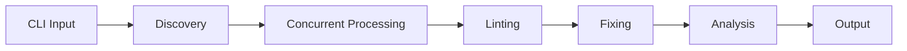

### Stage 1: CLI Entry

`cmd/gomdlint/main.go`

Cobra parses commands and flags. `internal/cli/lint.go:runLint()` orchestrates everything.

### Stage 2: Configuration

`internal/configloader/`

Discovers config files (`.gomdlint.yml`, `.gomdlint.yaml`) and merges: defaults → config file → CLI flags → environment variables.

### Stage 3: File Discovery

`pkg/runner/discovery.go`

Recursively finds `.md` and `.markdown` files, applying ignore patterns from config.

### Stage 4: Concurrent Processing

`pkg/runner/runner.go`

Worker pool with `runtime.NumCPU()` goroutines (configurable via `--jobs`). Each worker calls `Pipeline.ProcessFile()`. Results collected in deterministic order.

### Stage 5: Single-File Pipeline

`pkg/lint/pipeline.go:154-265`

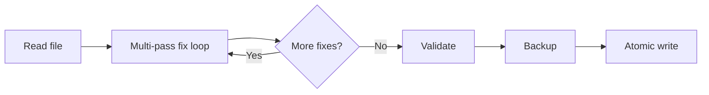

The multi-pass loop (up to 10 passes) handles cascading fixes—one rule's fix may resolve another rule's violation.

### Stage 6: Lint Engine

`pkg/lint/engine.go:78-165`

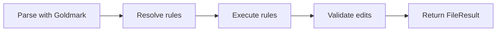

### Stage 7: Output

`pkg/reporter/`

`analysis.Analyze()` aggregates statistics, then the selected renderer formats output.

## Design Patterns

The codebase employs several well-established patterns:

### Registry Pattern

`pkg/lint/registry.go`

`DefaultRegistry` is a thread-safe singleton (protected by `sync.RWMutex`). Rules self-register via `init()` functions. Supports lookup by ID (`MD001`), name (`heading-increment`), or alias.

### Strategy Pattern

- **Parsers**: `lint.Parser` interface allows swappable implementations
- **Reporters**: Six output strategies selected at runtime by `--format`
- **Rules**: Each rule is a strategy for detecting a specific violation

### Builder Pattern

`pkg/lint/diagnostic_builder.go`

```go
lint.NewDiagnostic(r.ID(), node, message).
    WithSeverity(severity).
    WithSuggestion("Use ATX headings").
    WithEdit(fix.TextEdit{...}).
    Build()
```

Also `fix.EditBuilder` for accumulating text edits.

### Pipeline Pattern

`pkg/lint/pipeline.go`

Multi-stage processing: read → lint → fix → validate → backup → write. Each stage can fail independently with proper error propagation.

### Worker Pool Pattern

`pkg/runner/runner.go`

Fixed goroutine count processing from a work channel. Context-aware cancellation throughout.

### Dependency Injection

- Engine receives Parser and Registry
- Pipeline receives Engine
- Runner receives Pipeline
- Enables testing with mock implementations

### Visitor Pattern

`pkg/mdast/walk.go`

`Walk()` traverses AST in pre-order. Helper functions like `lint.Headings()`, `lint.Paragraphs()` simplify rule implementation.

## Layer Architecture

The system is organized into eight distinct layers with clear responsibilities:

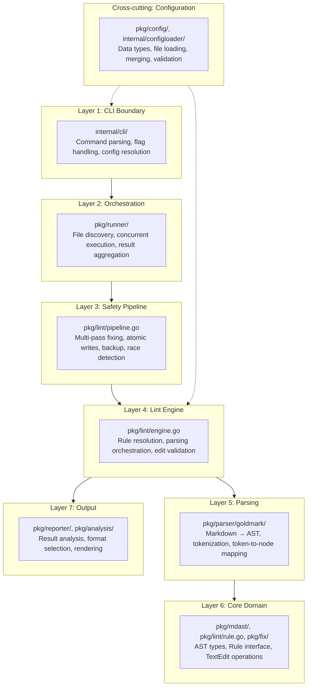

**Key constraint**: Dependencies flow downward only. Higher layers depend on lower layers, never the reverse. The `internal/` packages are application-specific and cannot be imported by external consumers.

## Extension Points

The architecture provides four primary extension points:

### Adding a New Rule

`pkg/lint/rules/`

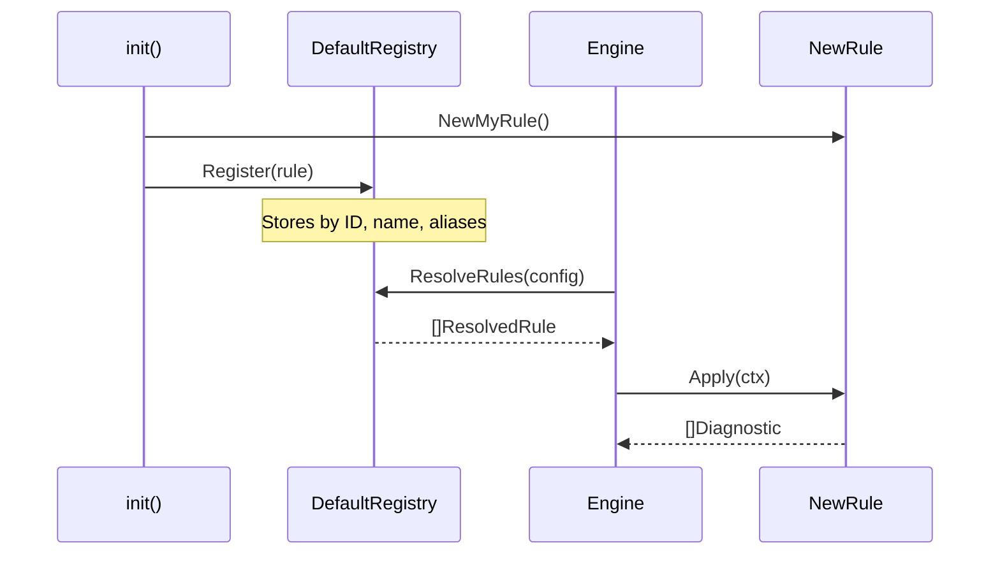

Steps:

1. Create file in `pkg/lint/rules/` (e.g., `my_rule.go`)
2. Embed `lint.BaseRule` for default implementations
3. Implement `Apply(ctx *RuleContext) ([]Diagnostic, error)`
4. Register in `register.go`: `registry.Register(NewMyRule())`

### Adding a New Output Format

`pkg/reporter/`

1. Implement `Renderer` interface with `Render(ctx, *analysis.Report) error`
2. Add format constant to `pkg/config/format.go`
3. Register in `reporter.go`'s `New()` switch statement

### Adding a New Parser

`pkg/parser/`

1. Create new package implementing `lint.Parser` interface
2. Return fully-populated `*mdast.FileSnapshot` with tokens and AST
3. Wire in CLI to instantiate the new parser

### Adding Configuration Sources

`internal/configloader/`

Current sources: YAML files, CLI flags, environment variables. New sources can be added by modifying the merge logic in configloader.

## Concurrency Model

The runner implements a worker pool pattern for parallel file processing:

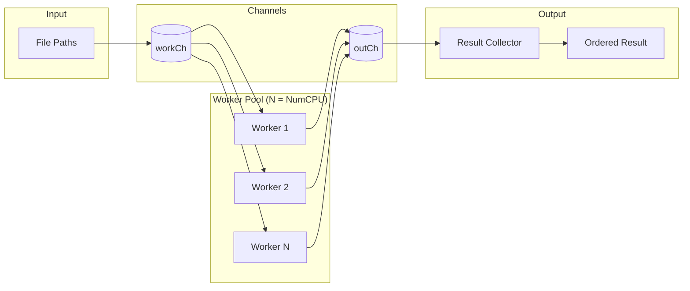

### Thread Safety Guarantees

| Component | Mechanism | Location |
|-----------|-----------|----------|
| Registry | `sync.RWMutex` | `pkg/lint/registry.go:6` |
| Parser | Stateless, concurrent-safe by contract | `pkg/lint/parser.go` |
| Engine | Stateless, no shared mutable state | `pkg/lint/engine.go` |
| Pipeline | Stateless, operates on isolated file data | `pkg/lint/pipeline.go` |

### Context Propagation

All operations respect context cancellation:

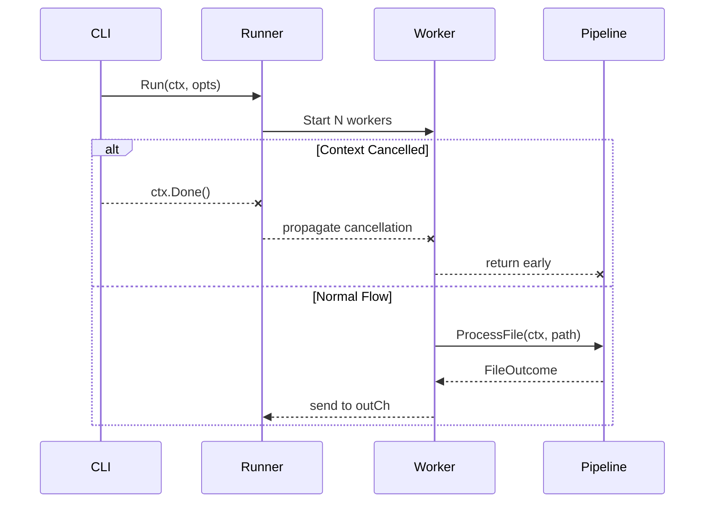

**Deterministic Output:** Results are collected into a map keyed by file path, then output in sorted order regardless of worker completion order.

## Error Handling

Errors are categorized and handled at appropriate layers:

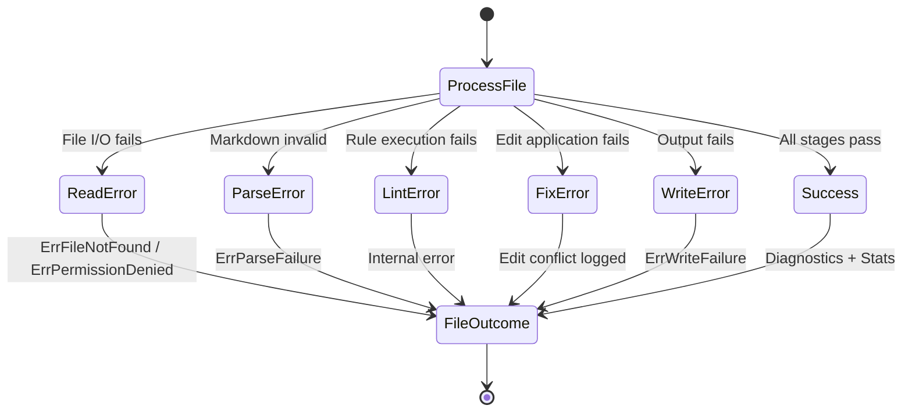

### Pipeline Error Types

`pkg/lint/pipeline.go:19-32`

| Error | Cause | Recovery |
|-------|-------|----------|
| `ErrFileNotFound` | File doesn't exist | Skip file, report |
| `ErrPermissionDenied` | No read/write access | Skip file, report |
| `ErrParseFailure` | Malformed Markdown | Skip file, report |
| `ErrWriteFailure` | Disk full, permissions | Report, preserve original |

### Rule Execution Contract

- Rules return `error` only for internal failures (bugs, panics)
- Violations are returned as `[]Diagnostic`, not errors
- Rules should never panic—defensive coding required

### Edit Conflict Resolution

`pkg/fix/validate.go`

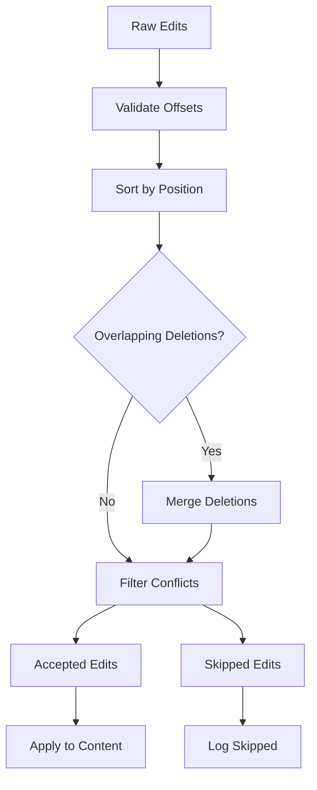

When edits conflict, earlier edits win (greedy algorithm). Overlapping pure deletions are merged when possible.

## Configuration Cascade

Configuration is resolved through a layered precedence system:

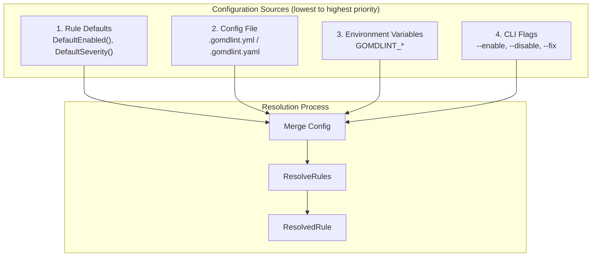

### Config File Discovery

`internal/configloader/`

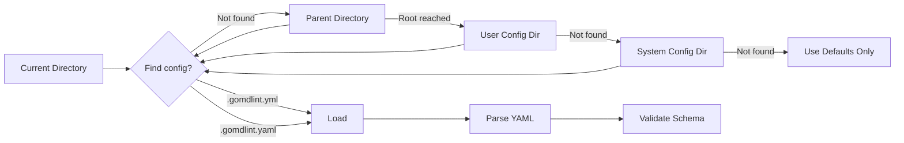

### Per-Rule Resolution

`pkg/lint/resolve.go:38-98`

For each rule, the final configuration is computed:

| Property | Default | Config File | CLI Override |
|----------|---------|-------------|--------------|
| `enabled` | `rule.DefaultEnabled()` | `rules.X.enabled` | `--enable/--disable` |
| `severity` | `rule.DefaultSeverity()` | `rules.X.severity` | `--strict` (promotes to error) |
| `autoFix` | `rule.CanFix()` | `rules.X.auto_fix` | `--fix-rules` filter |
| `options` | Rule-specific | `rules.X.options.*` | — |

**Rule Identification:** Config files accept both ID (`MD001`) and name (`heading-increment`) interchangeably via alias lookup in the registry.

## Design Principles

| Principle | Implementation |
|-----------|----------------|
| **Separation of Concerns** | Clear layer boundaries; each package has single responsibility |
| **Dependency Inversion** | Interfaces defined at consumer layer (lint defines Parser, not parser) |
| **Immutability** | FileSnapshot is read-only; Diagnostics are final once built |
| **Determinism** | Sorted output; deterministic file ordering; reproducible results |
| **Safety First** | Atomic writes; backup creation; race detection; multi-pass validation |
| **Extensibility** | New rules via init() registration; new formats via strategy pattern |
| **Testability** | Small interfaces; dependency injection; mockable components |
| **Fail Fast** | Validate early; categorized errors; context cancellation |
