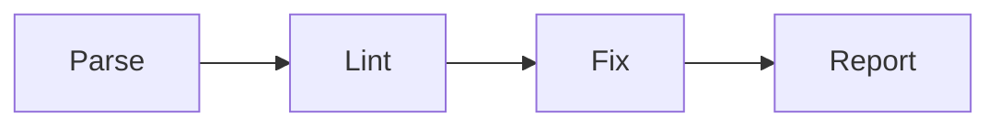
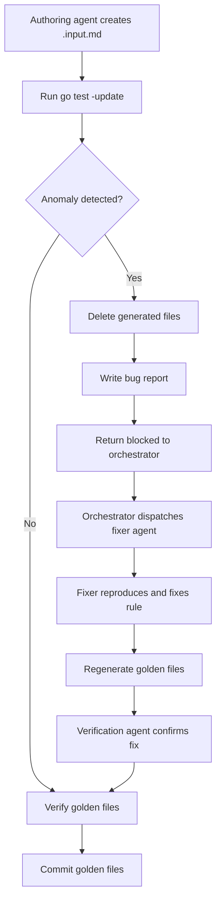

# Golden Test Methodology (With a twist)

## Introduction

This document describes how we built comprehensive golden test coverage for gomdlint's 55 lint rules — and how we used AI agents to do most of the work.

Golden testing is a well-known technique: you capture the output of your program, commit it, and fail the build if the output ever changes unexpectedly. What makes this project interesting is the scale and the process. We needed ~170 carefully constructed markdown files, each designed to trigger exactly one rule while avoiding false positives from the other 54. Writing those files requires detailed knowledge of every rule's behavior, its edge cases, and the dozen or so ways you can accidentally create a bad test input. That's a lot of domain knowledge to hold in your head across 55 rules.

So we encoded that knowledge into three reusable [Claude Code](https://docs.anthropic.com/en/docs/claude-code/overview) skills — structured instruction files that agents load before doing work. The [gap analysis skill](../.claude/skills/golden-test-gap-analysis.md) tells the agent how to audit the codebase and figure out what's missing. The [authoring skill](../.claude/skills/golden-test-authoring.md) tells it exactly how to construct test inputs for each edge-case category (frontmatter, unicode, code blocks, etc.) and what mistakes to avoid. The [verification skill](../.claude/skills/golden-test-verification.md) gives it a checklist to run after generating golden files. With those skills in place, we could dispatch 5 [sub-agents](https://docs.anthropic.com/en/docs/claude-code/sub-agents) in parallel, each working on a different group of rules, and get consistent results across all of them.

The output speaks for itself: 477 golden tests covering all 55 rules, a round-trip idempotency guarantee on every fixable rule, and three real bugs discovered and fixed in rule implementations along the way. The process also exposed a gap in the original agent workflow — agents had no protocol for handling broken rules — which led to a second iteration that added inter-agent bug detection, reporting, and repair.

This document covers the test system itself (how golden files work, what they verify, why the round-trip test matters) and the agent-driven process we used to create them (how the skills work, how we parallelized the effort, what went right and what we learned).

## Why write another markdown linter?

Linters are deceptively hard to build well. Parsing is the easy part — the real difficulty is in everything that comes after: tracking source positions accurately through an AST that doesn't always preserve them, generating edits that reference the right byte offsets in the original document, applying multiple edits without one fix invalidating the offsets of the next, and doing all of this without corrupting the file when something goes wrong.

Markdown makes this harder than most languages. The CommonMark spec is over 600 pages of edge cases. Inline syntax (emphasis, links, code spans) interacts in ways that surprise even experienced users. Different parsers disagree on ambiguous constructs. And source positions from the parser are sometimes approximate or missing entirely — as we discovered when goldmark's `ThematicBreak` nodes turned out to have no line information at all.

The dominant tool in this space is David Anson's [markdownlint](https://github.com/DavidAnson/markdownlint) — a JavaScript library (with the [markdownlint-cli2](https://github.com/DavidAnson/markdownlint-cli2) CLI) that powers the widely-used VS Code extension and countless CI pipelines. It's a well-maintained, battle-tested project with ~53 active rules, a clean plugin API for custom rules, and a large community. If you need a markdown linter today, markdownlint is the safe choice.

gomdlint was motivated by gaps that mattered for our specific use case:

**More auto-fix coverage.** markdownlint supports auto-fix for ~31 of its rules (~58%). Each fix is described by a single `fixInfo` object operating on one line, and fixes are applied in a single pass — conflicting edits on the same line are skipped. gomdlint fixes 37 of 55 rules (67%) using byte-range edits (`TextEdit`) that can span multiple lines, with a multi-pass loop that re-lints after each pass so previously conflicting edits get a second chance.

**Performance on large codebases.** Node.js has unavoidable startup overhead and single-threaded execution. gomdlint compiles to a native binary and processes files in parallel across all CPU cores. For a single file the difference is negligible, but across a monorepo with thousands of markdown files, it adds up.

**Go-native integration.** We wanted something that could be `go install`-ed, embedded as a library, and tested with standard Go tooling — not a Node.js dependency in a Go project's CI pipeline.

None of this diminishes markdownlint's value. Anson has maintained it since 2015, driven a migration from markdown-it to micromark, and built an ecosystem (VS Code extension, GitHub Actions, CLI tools) that gomdlint doesn't attempt to replicate. gomdlint is a narrower tool: a fast, fixable-first linter for teams that want Go-native tooling and aggressive auto-correction.

### By the numbers

| | gomdlint | markdownlint |
|---|---|---|
| Language | Go | JavaScript (Node.js) |
| Rules | 55 | ~53 |
| Auto-fixable | 37 (67%) | ~31 (58%) |
| Fix model | Byte-range `TextEdit`, multi-pass with conflict resolution | Line-based `fixInfo`, single-pass |
| Parser | goldmark (AST + token stream) | micromark |
| Parallel execution | Worker pool, `NumCPU()` goroutines | Single-threaded |
| Output formats | text, table, JSON, SARIF, diff, summary | JSON, SARIF (via CLI) |
| Configuration | YAML (flavors, per-rule options) | JSON/YAML (per-rule options, custom rules) |
| Ecosystem | CLI, Go library | CLI, VS Code extension, GitHub Action, npm library, custom rule plugins |

## What is gomdlint?

gomdlint is a Markdown linter written in Go. It checks `.md` files against 55 rules covering whitespace, heading structure, list formatting, link syntax, code blocks, emphasis style, HTML usage, and GFM table layout. 37 of the rules can auto-fix violations — the tool rewrites the file in place with the corrections applied.

### Architecture

The processing pipeline has four stages:



**Parse.** A [goldmark](https://github.com/yuin/goldmark)-based parser converts markdown into two parallel representations: an AST (`mdast.Node` tree) for structural analysis, and a token stream (`[]mdast.Token`) that classifies every byte in the source by kind — heading markers, list bullets, emphasis markers, code fences, and so on. Rules need both: the AST for understanding document structure (is this heading inside a blockquote?), and the token stream for precise source-level work (what character is at byte offset 47?).

**Lint.** Each enabled rule receives a `RuleContext` containing the parsed file, configuration, and a lazy-initialized cache of typed node queries (`ctx.Headings()`, `ctx.CodeBlocks()`, etc.). The rule inspects the document and returns diagnostics. Fixable rules also populate an `EditBuilder` with `TextEdit` values — byte-range replacements that describe how to correct each violation.

**Fix.** Collected edits go through validation (bounds checking), sorting (by start offset), and conflict resolution (overlapping edits resolved greedily — first by position wins). The accepted edits are applied in memory, and the result is re-parsed and re-linted. This loop repeats until no new edits are produced — the multi-pass approach handles cases where fixing one violation reveals or resolves another. A configurable pass limit (currently [hardcoded at 10](https://github.com/yaklabco/gomdlint/issues/11)) prevents infinite loops from buggy rules. The final output is written atomically with optional backup.

**Report.** Results are rendered in one of six formats: human-readable text, table, JSON, SARIF (for CI integration), unified diff, or statistical summary.

Files are processed in parallel across a worker pool sized to `runtime.NumCPU()`. Each file goes through the full pipeline independently, with results collected in deterministic order.

### Why the dual representation matters

Most markdown linters work from the AST alone. gomdlint adds the token stream because some rules need information the AST doesn't provide — or provides incorrectly. For example, goldmark's `ThematicBreak` nodes have no source position data (`Lines.Len() == 0`), but the tokenizer correctly emits `TokThematicBreak` tokens with byte offsets. Rules can fall back to the token stream when the AST is incomplete, which is exactly what the MD035 fix (described later) does.

The token stream also matters for fix generation. A rule that wants to change `__text__` to `*text*` needs to know where the underscore markers are in the source bytes, not just that an emphasis node exists in the AST.

## The Problem

gomdlint has 55 lint rules, 37 of which can auto-fix violations. When you change a rule's detection logic or fix generation, how do you know you haven't broken something? Unit tests can check individual cases, but they don't scale well — and they don't catch the subtle interaction between detection, fix generation, edit merging, and re-parsing that makes autofix tricky.

We needed a test strategy that:

- Catches regressions in both diagnostics and fix output
- Verifies fixes don't corrupt documents
- Scales to hundreds of scenarios without writing hundreds of test functions
- Makes it obvious when behavior changes (intentionally or not)

And then we needed to actually create ~170 hand-crafted test input files across all 55 rules — each one requiring knowledge of the specific rule's behavior, what markdown constructs trigger it, and what pitfalls to avoid (like accidentally triggering MD009 when you're trying to test MD012). Doing that by hand would be tedious and error-prone. So we taught AI agents how to do it.

## How the Golden Tests Work

The golden test system is built on a simple file convention:

```
testdata/MD009/
├── basic.input.md          ← you write this
├── basic.golden.md         ← generated: expected output after fix
├── basic.diags.json        ← generated: expected diagnostics
└── basic.diags.txt         ← generated: human-readable diagnostics
```

You only ever write `.input.md` files by hand. Everything else is generated.

### The Generate-Then-Lock Workflow

When you create a new test case or change a rule:

```bash
# Regenerate golden files for a rule
go test ./pkg/lint/rules/... -run TestGoldenPerRule/MD009 -args -update
```

This runs the rule against the input, captures the diagnostics and fixed output, and writes them to disk. You review the generated files — are the diagnostics correct? Does the fixed output look right? — and commit them.

From that point on, the golden files are locked. Any future change that produces different diagnostics or different fix output will fail the test. You either fix the regression or deliberately re-generate with `-update`.

### What Gets Tested

**TestGoldenPerRule** runs a single rule against each input file in its directory. It checks two things:

1. The diagnostics match `diags.json` exactly — same rule ID, line, column, message, severity, and fixability
2. After applying all fixes, the output matches `golden.md` byte-for-byte

**TestGoldenRoundTrip** goes further. It applies the fixes, then re-parses the fixed document and runs the rule again. If any fixable diagnostics remain, the test fails. This catches a class of bugs that are otherwise hard to detect:

- Fixes that shift byte offsets and break subsequent edits
- Fixes that introduce new violations
- Fixes that partially apply, leaving the document in a state that still triggers the rule

The round-trip guarantee means: **if the tool says it can fix something, applying the fix actually fixes it.**

### Test Discovery

The test harness discovers cases automatically. Drop an `.input.md` file into `testdata/MD009/` and it gets picked up on the next test run. No registration, no test function to write. The directory name determines which rule runs — `testdata/MD009/` runs MD009, `testdata/real-world/` runs all enabled rules.

### Fix Application

The fix pipeline is the same one users get. Diagnostics produce `TextEdit` values (byte offset ranges + replacement text). The edits go through:

1. **Validation** — bounds checking against document length
2. **Sorting** — by start offset
3. **Merge/conflict resolution** — overlapping deletions get merged into a single edit; other overlaps are resolved greedily (earlier edit wins)
4. **Application** — cursor-based splice of the original content

This means the golden tests exercise the real fix pipeline, not a simplified test double. If there's a bug in edit merging or offset calculation, a golden test will catch it.

## How We Created 170 Test Files With Agents

We started with 23 rules that had golden tests and needed to get to 55 — plus add edge-case coverage for all of them. That's roughly 170 input files, each needing to be carefully constructed markdown that triggers exactly one rule without accidentally tripping others. Getting that right requires knowing things like: always end with a newline (or you trigger MD047), don't use tabs (MD010), no trailing whitespace (MD009), use proper heading hierarchy (MD001), and so on.

We used Claude Code agents to do this, but the interesting part is *how* we made it reliable.

### The Skills

We wrote three project-specific skills (instruction files that agents load before doing work) that encode the rules for golden test creation:

**golden-test-gap-analysis** — Tells the agent how to analyze the 55 rules, read each implementation, check what test cases exist, and produce a coverage report. It defines the edge-case categories (frontmatter, code_block_immunity, unicode, etc.) and when each applies. The agent reads every rule's source code, checks which ones call `ctx.IsLineInCodeBlock()`, which ones are fixable, and maps out what's missing.

**golden-test-authoring** — The detailed rulebook for creating input files. It specifies the file naming convention, content structure, size guidelines, and templates for each edge-case category. Critically, it includes a "common mistakes" table: don't accidentally use tabs, don't leave trailing whitespace, always start with a heading, etc. These are the kinds of things that cause cascading test failures when you get them wrong, and encoding them in a skill means agents don't have to learn them the hard way.

**golden-test-verification** — The checklist agents follow after generating golden files. Read the `.diags.json`, check the line numbers make sense, verify `clean` cases produce zero diagnostics, verify `code_block_immunity` cases produce zero diagnostics, run the round-trip test. It also lists red flags: if a clean case produces diagnostics, the input has accidental violations; if a round-trip test fails, the fix is non-idempotent.

### The Phased Approach

We broke the work into phases, each dispatching multiple agents in parallel:

**Phase 1 — Gap Analysis.** One agent read all 55 rule implementations, catalogued existing test coverage, and produced a coverage matrix. This told us exactly what was missing: 32 rules had zero golden tests, and even the 23 that had tests were missing edge-case categories.

**Phase 2 — Basic + Clean.** Five agents ran in parallel, each handling a group of rules (heading rules, list rules, link rules, etc.). Each agent created `basic.input.md` and `clean.input.md` for its assigned rules, generated the golden files with `-update`, read the output to verify correctness, and ran the tests. By the end, all 55 rules had test directories.

**Phase 3 — Edge Cases for Fixable Rules.** Five more agents in parallel. Each one took a group of fixable rules and added frontmatter, code_block_immunity, unicode, multiple, adjacent, and nested cases as applicable. This is where the authoring skill really paid off — an agent working on MD009 (trailing whitespace) needs to create a `unicode.input.md` with trailing spaces after multi-byte characters like `你好` and `🎉`, and the skill tells it exactly how to structure that.

**Phase 4 — Edge Cases for Non-Fixable Rules.** Three agents covered the remaining rules. Non-fixable rules need fewer edge cases (no offset shifting to worry about), so this phase focused on frontmatter and code_block_immunity scenarios.

**Phase 5 — Full Verification.** Ran the complete test suite (477 golden tests + the rest of the project's 2041 tests), confirmed everything passes, committed.

### Why Agents + Skills Worked Here

The key insight is that writing golden test input files is a task with very precise rules that are easy to get wrong in subtle ways. A human writing `frontmatter.input.md` for MD012 (no-multiple-blanks) might accidentally leave trailing whitespace on a line, which would cause the generated diagnostics to include MD009 violations — and the test would still pass (it only runs MD012), but the input wouldn't be testing what you think it's testing.

The skills encode all of these constraints in one place. Every agent loads the same authoring rules and verification checklist. That consistency is hard to maintain across 170 files if you're writing them by hand over multiple sessions.

The parallel dispatch is the other big win. Five agents creating test files for different rule groups simultaneously, with no file conflicts because each rule has its own directory. The total wall-clock time for creating all the test files was a fraction of what sequential work would have taken.

The agents also found real bugs in three rule implementations during the process — but the initial approach to handling them was wrong. More on that in the next section.

### Trust Model

The agents don't decide what's correct — the tool does. The workflow is:

1. Agent creates a `.input.md` file (following the skill's rules)
2. Agent runs `go test -update` to generate golden files from the *actual rule implementation*
3. Agent reads the generated diagnostics and fix output to verify they make sense
4. Agent runs `TestGoldenRoundTrip` to verify fix idempotence

The golden files are a snapshot of the tool's real behavior. If that behavior is wrong, the golden test locks it in — and you fix the rule, not the test. The agents verify that the snapshot is internally consistent (diagnostics match what the code produces, fixes are idempotent), but they don't invent expected output.

But this trust model has a gap: it assumes the tool's behavior is correct. What happens when it isn't? That's the problem we ran into next.

## What Went Wrong: Baselining Broken Behavior

The initial five-phase process had a critical flaw. When agents encountered rules that produced wrong results, they had no protocol for handling it. They accepted whatever the tool produced and committed it as the expected output. This locked broken behavior into the test suite.

Three rules were affected:

**MD035 (HR style)** — Goldmark's `ThematicBreak` AST nodes have no source positions (`Lines.Len() == 0`). The rule's position check silently skipped every thematic break, producing zero diagnostics for files with mixed HR styles. The agent generated `basic.diags.json` as `[]` — an empty diagnostic array for a file that clearly contained violations — and committed it.

**MD049/MD050 (emphasis/strong style)** — `detectEmphasisStyle()` reads `lineContent[pos.StartColumn-1]` expecting the marker character (`*` or `_`), but goldmark's `SourcePosition` points to the emphasis *content*, not the marker. The function returned `""` for every emphasis node, producing zero diagnostics. Same root cause for strong emphasis. Both `basic.diags.json` files were committed as `[]`.

**MD034 (bare URLs)** — The autofix regex `(?:^|[^<(\[])(URL|EMAIL)(?:[^>\])]|$)` uses boundary-consuming groups. After wrapping `user@example.com` in angle brackets, the consumed boundary character shifts the capture indices — the regex matches `ser@example.co` inside the already-wrapped email, producing a false positive that corrupts the document. The agent noticed this during round-trip testing and worked around it by avoiding email test patterns entirely.

In all three cases, the agents noticed something was wrong but had no mechanism to fix it. They documented the issues in comments, adjusted expected values to match the broken output, and moved on. The result: golden tests that would *fail* if someone ever fixed these rules, because the tests expected the broken behavior.

This violates the core principle stated in our own trust model: "you fix the rule, not the test." We stated the principle but didn't enforce it.

## How We Fixed It: Inter-Agent Bug Detection and Repair

We added three things: a way for agents to detect anomalies, a way to report them, and a dedicated agent role for fixing them.

### Bug Detection Protocol

The [authoring skill](../.claude/skills/golden-test-authoring.md) now includes an anomaly checklist that agents must run after every `go test -update`:

| Anomaly | How to Detect | What It Means |
|---------|--------------|---------------|
| Zero-diagnostic | `.diags.json` is `[]` for a non-clean, non-code_block_immunity scenario | Rule detection is broken |
| Golden-equals-input | `.golden.md` is byte-identical to `.input.md` for a fixable rule with violations | Rule fix is broken |
| Round-trip failure | Fixable diagnostics remain after one pass | Fix is non-idempotent or creates new violations |
| Position anomaly | Diagnostics report line 0 or column 0 | Position calculation bug |

When an anomaly is detected, the agent must **stop** — not work around it. It deletes the generated golden files (keeping only the hand-crafted `.input.md`), writes a structured bug report, and returns to the orchestrator with a blocked status. No broken behavior gets committed.

### Bug Reports

Bug reports live in `.claude/bug-reports/<RULE_ID>-<slug>.md` with YAML frontmatter tracking the lifecycle:

```
status: open → fixing → fixed → verified
```

Each report includes the symptom, root cause analysis, evidence (test output), and a proposed fix. This gives the fixer agent everything it needs to reproduce and resolve the issue without re-investigating from scratch.

### Bug Fixing Skill

A new [bug-fixing skill](../.claude/skills/golden-test-bug-fixing.md) guides a dedicated fixer agent through the full repair cycle:

1. **Reproduce** — write a Go test that fails before the fix
2. **Trace** — identify whether the bug is in source positions, style detection, or fix idempotency
3. **Fix** — implement the fix in the rule, not the test harness
4. **Update tests** — change `wantDiags: 0` to the correct value, remove "parser limitation" comments
5. **Regenerate** — delete old golden files, run `-update`, verify diagnostics are no longer empty
6. **Verify** — round-trip test, full golden suite, full test suite
7. **Close** — update the bug report to `status: fixed`

The skill includes common fix patterns (token-stream bypass for missing AST positions, backward/forward scan for incorrect position offsets) that apply across multiple bug categories.

### Verification Gate

The [verification skill](../.claude/skills/golden-test-verification.md) now checks for open bug reports before verifying a rule's golden files. Rules with `status: open` or `status: fixing` are skipped. After a fix lands (`status: fixed`), the verification agent re-checks the regenerated golden files and updates the report to `status: verified`.

The red flags table was also expanded — "`.diags.json` is `[]` for a basic scenario with clear violations" is now an explicit red flag with the instruction: "file a bug report, do not baseline."

### The Fixes

With this process in place, we fixed all three bugs:

**MD035** — Rewrote the Apply method in `hr.go` to iterate `ctx.File.Tokens` instead of using AST node positions. `TokThematicBreak` tokens are correctly emitted by the tokenizer regardless of goldmark's AST limitations. The rule now uses `ctx.File.LineAt(tok.StartOffset)` to convert byte offsets to line/column and `lint.NewDiagnosticAt()` to construct diagnostics with explicit positions.

**MD049/MD050** — Fixed `detectEmphasisStyle()` and `detectStrongStyle()` in `emphasis.go` to scan backward from the content position to find the marker character. For emphasis, one position back (`pos.StartColumn-2`); for strong, two positions back (`pos.StartColumn-2` and `pos.StartColumn-3`). These functions now correctly identify `*` vs `_` markers.

**MD034** — Replaced the boundary-consuming regex with a simpler pattern that matches only the URL/email itself, then validates boundaries in code (checking for `<`, `(`, `[` before the match and `>`, `)`, `]` after). This eliminated the index-shifting bug entirely. Added 8 email-specific edge case tests covering start/end of line, multiple emails, plus addressing, already-wrapped emails, and mixed URL/email content — all passing including idempotency checks.

After the fixes, regenerated golden files for all affected rules. `basic.diags.json` for MD035, MD049, and MD050 now contain actual diagnostics instead of empty arrays. The test count went from 2041 to 2050 (9 new tests from the MD034 email edge cases and bug reproduction tests).

### Process Flow

The full workflow now looks like this:



The key change is the branch at step 3. Previously, agents had no branch — they always proceeded to commit, even when the output was clearly wrong. Now they halt, report, and wait for a fix before generating golden files for that rule.

## Edge Case Categories

Each rule gets test cases from a set of categories based on what's applicable:

| Category | What It Tests |
|----------|--------------|
| `basic` | The rule's core detection and fix behavior |
| `clean` | A file with no violations — should produce zero diagnostics |
| `frontmatter` | Content after YAML frontmatter (`---` blocks) — catches off-by-N line counting |
| `code_block_immunity` | Rule trigger patterns inside fenced code blocks — should produce zero diagnostics for rules that skip code blocks |
| `unicode` | Multi-byte characters (CJK, Cyrillic, emoji) — catches byte vs. rune offset bugs |
| `multiple` | Several violations in one file — tests batch fix application with offset shifting |
| `adjacent` | Violations on consecutive lines — tests that fixes don't interfere with each other |
| `nested` | Content inside blockquotes or nested lists |
| `empty_file` | Zero-byte input — tests early-return paths |

Not every category applies to every rule. A rule that doesn't skip code blocks doesn't need `code_block_immunity`. A non-fixable rule doesn't need `multiple` (since there's no offset shifting to worry about). The categories are assigned per-rule based on the rule's implementation.

## Current Coverage

477 golden tests across all 55 rules (2050 total tests including unit tests). Every rule has at least `basic` and `clean` cases. Fixable rules have edge-case coverage for frontmatter, code block immunity, unicode, and batch fix scenarios. Non-fixable rules have frontmatter and (where applicable) code block immunity cases.

```bash
# Run all golden tests
go test ./pkg/lint/rules/... -run TestGolden

# Run tests for a specific rule
go test ./pkg/lint/rules/... -run TestGoldenPerRule/MD009

# Regenerate after changing a rule
go test ./pkg/lint/rules/... -run TestGoldenPerRule/MD009 -args -update
```
