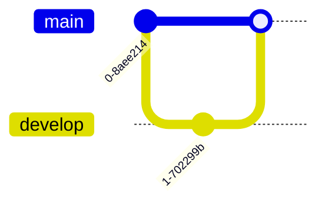
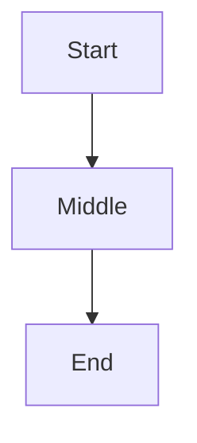

# Test Valid References

GitGraph with all branches defined:

```mermaid
gitGraph
    commit
    branch develop
    checkout develop
    commit
    checkout main
    merge develop
```

Flowchart with all nodes defined:

```mermaid
flowchart TD
    A[Start] --> B[Middle]
    B --> C[End]
```
