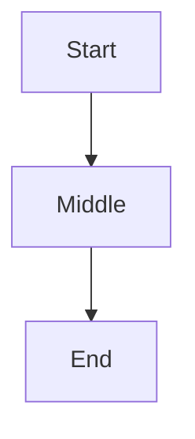
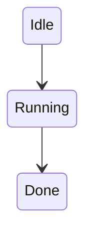

# Test Valid Identifiers

Flowchart with unique node IDs:

```mermaid
flowchart TD
    A[Start] --> B[Middle]
    B --> C[End]
```

State diagram with unique states:

```mermaid
stateDiagram-v2
    state "Idle" as S1
    state "Running" as S2
    state "Done" as S3
    S1 --> S2
    S2 --> S3
```
