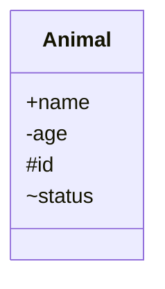
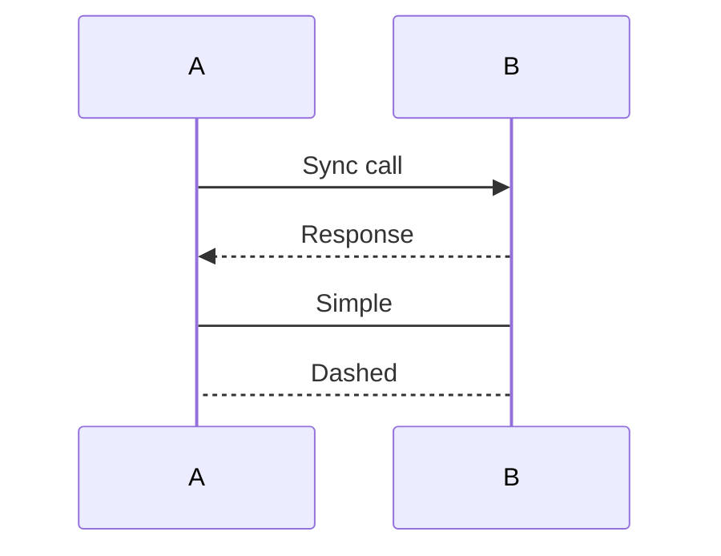
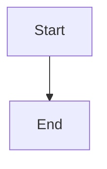

# Valid Type Check Examples

This file contains mermaid diagrams with valid type modifiers and relationships.

## Valid Class Diagram

```mermaid
classDiagram
    class Animal {
        +name
        -age
        #id
        ~status
    }
```

## Valid Sequence Diagram

```mermaid
sequenceDiagram
    A->>B: Sync call
    B-->>A: Response
    A->B: Simple
    B-->A: Dashed
```

## Valid Flowchart

```mermaid
flowchart TD
    A[Start] --> B[End]
```
